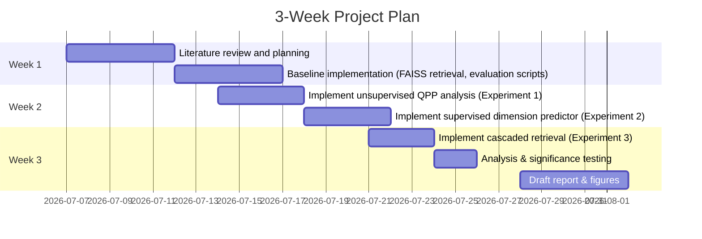

# Executive Summary  
Matryoshka (hierarchical) embedding models train a single encoder to produce multi-scale representations whose prefixes suffice for retrieval or classification. Recent work (e.g. **Matryoshka-Adaptor**, **Search-Adaptor**) has shown large reductions in embedding size with little loss in accuracy, and **query-aware dimension selection** (e.g. **DIME**, **ECLIPSE**, **Learning to Select**) can further prune irrelevant coordinates per query. However, it remains unclear which *query features* predict the needed embedding “resolution” (i.e. number of dimensions) and how best to exploit query-level adaptivity on real IR tasks. Our review finds gaps in connecting query difficulty measures (e.g. QPP) to embedding resolution and in benchmarking adaptive retrieval strategies on diverse datasets. We propose experiments – using SciFact, Quora, FiQA, NFCorpus, ArguAna – to evaluate (a) unsupervised query difficulty signals for dimensional pruning, (b) learned dimension-selection models vs heuristic baselines, and (c) cascade retrieval pipelines that escalate embedding size only as needed. We expect these studies to yield insight into query-dependent retrieval strategies and guide efficient retrieval without sacrificing accuracy.  

# Annotated Bibliography  

- **Kusupati et al., 2022 (NeurIPS)** – *“Matryoshka Representation Learning.”* Introduces **Matryoshka embeddings**, training a network so that any prefix of its output vectors (e.g. first 8,16,…,2048 dims) is itself a valid embedding. This allows coarse-to-fine inference: “easy” items use fewer dimensions, and only “hard” queries go to full dimensionality. Demonstrated up to *14×* reduction in expected embedding cost on ImageNet with no accuracy loss. **Relevance:** Foundational multi-scale embedding paradigm for hierarchical retrieval.  
- **Yoon et al., 2024a (ACL)** – *“Search-Adapter: Embedding Customization for IR.”* Proposes a supervised adapter layer on top of any frozen encoder to optimize embeddings for retrieval. Unlike query-specific pruning, this is a global linear projection trained on relevance labels. Improves full-dimension performance substantially but applies uniformly to all queries. **Relevance:** Demonstrates the limits of global fine-tuning vs. query-dependent methods.  
- **Yoon et al., 2024b (EMNLP)** – *“Matryoshka-Adaptor: Un-/Semi-Supervised Tuning for Smaller Embeddings.”* Introduces adapters that convert arbitrary pretrained encoders into matryoshka models. Without changing the base model, they train prefix-specific heads so that 8×–32× smaller embeddings match original recall. **Relevance:** Shows that existing high-dimensional encoders (e.g. BERT, OpenAI embeddings) can be adapted to produce nested sub-embeddings with little loss, a practical alternative to training new multi-scale models.  
- **Wu et al., 2026 (ArXiv)** – *“Learning to Select: Query-Aware Adaptive Dimension Selection.”* Proposes a learned predictor that maps a query embedding to per-dimension importance scores, distilled from relevance labels. At query time, the model masks unimportant dims and retrieves with the reduced query vector (documents remain full). Experiments across multiple retrievers show this method beats full-dimension baselines and PRF-based DIME/ECLIPSE methods. **Relevance:** State-of-the-art in supervised query-specific dimension pruning; highlights the value of learning query-resolved masks.  
- **Faggioli et al., 2024 (SIGIR)** – *“Dimension Importance Estimation for Dense IR.”* Introduces **DIME**, an unsupervised PRF-based approach: for each query, use an initial retrieval result to identify “important” embedding dimensions and compute similarity only in that subspace. This often boosts ranking by removing noisy dims. Key idea: high-dimensional embeddings often live on query-specific low-dim manifolds. **Relevance:** Early work demonstrating that query-dependent dimensional pruning can improve dense retrieval without any retraining.  
- **Campagnano et al., 2025 (SIGIR)** – *“Unveiling DIME: Reproducibility, Generalization, and Analysis.”* Provides a formal analysis of DIME and extensive experiments. Confirms DIME’s benefits and shows it works across many embedding models, including **matryoshka** encoders, cosine-optimized models, etc.. Proposes refinements (attention-PRF, etc.). **Relevance:** Validates and extends DIME-type methods, emphasizing that dimensionality issues persist even with new embedder architectures.  
- **D’Erasmo et al., 2025 (ArXiv)** – *“ECLIPSE: Contrastive Dimension Importance.”* Extends DIME by incorporating **pseudo-irrelevant** documents. They compute a centroid of non-relevant docs as a “noise” reference and contrast with relevant doc embeddings, identifying spurious dimensions. ECLIPSE yields huge gains (up to +19.5% mAP over DIME) by better separating noise. **Relevance:** Advances pseudo-feedback pruning, demonstrating that incorporating negative info further improves query-specific dimension selection.  
- **Zhuang et al., 2024 (preprint)** – *“Starbucks: Improved Training for 2D Matryoshka Embeddings.”* Addresses weak effectiveness of multi-layer matryoshka training. Proposes a new “Starbucks” two-part training (MAE pretraining + structured fine-tuning) that produces a single model whose sub-networks (various layer-depth × dim) match the performance of separately trained small models. Outperforms previous 2D-Matryoshka (2DMSE/ESE) on passage retrieval and STS. **Relevance:** Shows how careful training can yield one model replacing many, enabling flexible retrieval across both depth and dimension axes.  
- **Li et al., 2024 (SIGIR)** – *“2D-Matryoshka Sentence Embeddings (Espresso).”* (Also referred to as 2DMSE/ESE.) A single BERT can produce a grid of sub-embeddings (layer, dim) by applying matryoshka supervision at multiple intermediate layers. Enables elastic retrieval with variable model size. **Relevance:** Introduced the concept of “matryoshka across layers”, motivating Starbucks’s improvements; shows multi-granularity representation is broadly applicable.  
- **Saleminezhad et al., 2025 (Machine Learning)** – *“ADG-QPP: Robust QPP for Dense Retrievers.”* Unsupervised **query performance prediction** (QPP) by injecting query-specific “disturbances” into the embedding and measuring retrieval robustness. They generate per-query perturbations and compute graph-based features, achieving higher correlation with actual performance than prior QPPs. **Relevance:** An example of dense-specific QPP that could be leveraged to estimate when a query is hard (hence might need more dimensions) or easy.  
- **Vlachou & Macdonald, 2023 (ArXiv)** – *“Coherence-based Predictors for Dense QPP.”* Extends classical coherence QPPs to dense retrieval (ANCE, ColBERT). They measure pairwise embedding coherence among top docs and show unsupervised predictors can greatly outperform sparse-based QPP (up to +188% correlation). **Relevance:** Demonstrates dense-retrieval-specific unsupervised difficulty metrics, suggesting that embedding-space patterns correlate with query success.  
- **You et al., 2025 (ICLR)** – *“Asymmetric Embedding Models for Hierarchical Retrieval.”* Studies retrieval in hierarchical taxonomies; shows that to *provably* encode a hierarchy of depth *k*, one needs embedding dimension ~k. They propose asymmetric dual-encoders that capture ancestor-descendant relations. **Relevance:** Although not about Matryoshka per se, this underscores that embedding dimension is crucial for capturing structured relevance, and motivates query-dependent encoding.  

# Open Research Questions / Gaps  

- **Query features vs. dimension needs:** Which query characteristics predict how many dimensions are truly needed to retrieve its relevant docs? (e.g. length, semantics, QPP scores). Existing studies note no simple linear pattern, but this remains open.  
- **Evaluation of query-adaptive pruning:** How do learned predictors (e.g. Wu et al.) compare to unsupervised heuristics (DIME/ECLIPSE) across tasks and embedding types? Can hybrid schemes (semi-supervised, or light fine-tuning) yield better trade-offs?  
- **Cost–accuracy trade-offs:** What is the optimal retrieval cascade strategy? For example, use 64-dim embeddings for “easy” queries and escalate on “hard” ones. How to detect when to escalate (confidence threshold, second-stage recall)?  
- **Generalization across domains:** Do query-specific dimension methods generalize to highly structured tasks (SciFact fact-checking, technical QA) vs. conversational (Quora), vs. finance (FiQA)?  
- **Multimodal/hybrid retrieval:** Can Matryoshka-style embeddings be applied in vision-text or MM retrieval, and does query adaptivity translate to multimodal queries?  
- **Effect of index/ANN structure:** All these methods assume an unchanged document index. How do they interact with quantization, FAISS parameters, or multi-vector indexes (ESPN) in practice?  
- **Limited labels / unsupervised adaptation:** Supervised adapters require relevance labels. Can we bootstrap query-difficulty detection in low-resource settings (using e.g. LLM pseudo-judgments, synthetic QPP)?  
- **Metric alignment:** Is Recall@K the right metric for assessing adaptive retrieval? Perhaps MRR or NDCG might emphasize different aspects for query-dependent strategies.  

# Proposed Experiments  

**Gap 1 – Unsupervised QPP→Dimension:** Test if unsupervised query performance predictors can guide dimension selection. *Setup:* For each query in SciFact, Quora, FiQA, NFCorpus, ArguAna, compute one or more QPP metrics (e.g. ADG-QPP score, or coherence from Vlachou & Macdonald). Also compute the “required dimension” for each query (the smallest D for which a relevant doc ranks in the top-𝑘). Analyze correlation (Spearman/Pearson) between QPP scores and required dimension. *Metrics:* Spearman ρ between predictor and needed dim; scatter plots of prediction vs. actual. *Baselines:* Random or query length baseline. *Expected:* If strong correlation exists, one could threshold QPP to set D. For example:  
```python
for query in queries:
    q_emb = model.encode(query)
    score = ADG_QPP(q_emb)   # e.g. use disturbance generation (pseudocode)
    required_D = find_min_dim_with_recall(query, docs, k=1)
    # record (score, required_D)
# Compute Spearman between lists of score and required_D
```  
Anticipated: QPP methods may correlate modestly; e.g. easier queries (high coherence) might require fewer dims. If correlation is significant, one can classify queries into “easy/hard” and use smaller/larger embeddings adaptively.  

**Gap 2 – Learned vs. Heuristic Dimension Selection:** Compare the **Learning-to-Select** predictor (or our re-implementation) with PRF-based DIME/ECLIPSE and fixed-dim baselines. *Setup:* Use the same embedding model (e.g. SentenceTransformer). Label a training set of query-doc relevances (if available, e.g. SciFact) to learn a small feed-forward network: input = query embedding, target = importance distribution over 768 dims (from ground-truth relevance). At inference on held-out queries, mask the least-important dims and retrieve. *Metrics:* Recall@10 (or MRR@10) and *average dimensions used* across queries. Compute improvement over full-dim baseline and over “full-mask” (no selection). *Baselines:* (1) Full 768-dim retrieval. (2) Fixed low-dim (e.g. 128-dim) embedding. (3) DIME-PRF/ECLIPSE: use top-1 doc to select dims (no learning). *Pseudocode:*  
```python
# Training (offline):
for epoch:
    for (q, pos_docs, neg_docs) in training_data:
        # Compute oracle importance: which dims separate pos vs neg?
        oracle_scores = compute_dim_importance(q, pos_docs, neg_docs)
        pred_scores = predictor(q_emb)
        loss = KL(pred_scores, oracle_scores)
        update(predictor, loss)
# Inference:
for query in test_queries:
    q_emb = encoder(query)
    imp = predictor(q_emb)
    D = top_k_dims(imp, k)   # keep top k dims based on budget
    masked_q = mask_dims(q_emb, D)
    results = faiss.search(masked_q, k=10)  # docs are full embeddings
```  
*Expected:* The learned predictor should outperform PRF-based masks when good labels exist. We expect recall close to full-dim with fewer dims on average (as reported by Wu et al.).  

**Gap 3 – Cascaded Retrieval Pipeline:** Evaluate a two-stage retrieval: first with very low-dimensional embeddings, then (only for “uncertain” queries) escalate to full embedding. *Setup:* For each query, retrieve top-𝑘 using e.g. 64-dim prefix. If the best score margin (or top score) is below a threshold (suggesting low confidence), then retrieve again at 768 dims. Measure trade-off between computation and recall. *Metrics:* Recall@10, *Average #dimensions used per query*, and total inference cost. *Baselines:* (a) Always full 768 dims, (b) always low (64 dims). *Pseudocode:*  
```python
threshold = θ
for query in queries:
    q_emb = encoder(query)
    # Stage 1: low-dim retrieval
    res1, scores1 = retrieve(query, dims=64, k=10)
    # Check confidence
    if scores1[0] - scores1[1] < threshold:  # if uncertain
        res2, _ = retrieve(query, dims=768, k=10)
        final_res = res2
        dims_used = 64+768
    else:
        final_res = res1
        dims_used = 64
    record(final_res, dims_used)
```  
*Expected:* For some queries (the “easy” ones), the 64-dim retrieval will already find the correct doc (score gap large) so 768 is not used, saving cost. Hard queries will fall back to full retrieval. We measure how recall drops (if at all) and how many queries needed the second stage. This explores adaptive fidelity.  

# Statistical Tests  
For comparing retrieval methods, we will use paired significance tests (queries are paired). For metrics like Recall@𝑘 or MRR, we will employ **paired t-tests or Wilcoxon signed-rank tests** (non-parametric) on per-query scores between methods. Report *p*-values (e.g. *p*<0.05 as significant) and effect sizes (e.g. Cohen’s *d*). To evaluate correlation (QPP vs dims), use Spearman’s ρ significance. Confidence intervals (95%) via bootstrapping over queries can accompany means.  

# Potential Pitfalls and Mitigations  

- **Noisy / Incomplete Relevance:** Datasets (especially user-generated Q&A) may have missing relevant documents. Mitigate by focusing on Recall@1–5 (which requires at least one hit) or by using multiple ground-truth documents (like Quora paraphrases) to reduce noise.  
- **Small Sample Sizes:** Datasets like SciFact or FiQA have limited queries. Use multiple datasets (we have five) to generalize findings. Apply cross-validation or leave-one-out to maximize training data for supervised methods.  
- **Model Bias:** Learned predictors (like Wu’s method) might overfit the train split. Use early stopping and validate on a separate set. For unsupervised QPP, ensure test queries differ from any used to tune thresholds.  
- **Latency vs Accuracy Trade-off:** Measuring “cost” of different dims is tricky. As a proxy, we count dimensions and note FAISS index structure remains fixed (so cost ~ inner-product dims). We should clarify any assumption (e.g. memory footprint vs compute).  
- **Dimensionality Alignment:** Masking dims (zeroing query dims) assumes document embeddings are aligned. Using truncated prefixes avoids this. Our pipeline should either re-index truncated embeddings or rely on learned adapters designed for prefix truncation.  
- **Hyperparameter Sensitivity:** Thresholds (e.g. in cascade confidence) may need tuning. We will sweep reasonable values on a dev set, and ensure stable gains across thresholds.  

# Timeline and Deliverables  



- **Week 1:** Survey literature (this report), set up data and baseline retrieval pipelines (Script to compute Recall@𝑘 at various dims).  
- **Week 2:** Run Experiment 1 (unsupervised QPP vs dims): code to compute QPP metrics and correlate with needed dims. Begin Experiment 2: train the dimension-selection predictor.  
- **Week 3:** Complete Experiment 2 and run Experiment 3 (cascaded strategy). Perform statistical analysis. Prepare report with tables/figures.  

Deliverables each week include code notebooks and intermediate summaries; final deliverable is a written report with results.  

# Suggested Figures and Tables  

- **Table:** *Key Methods Summary* – list methods (MRL, Adapters, DIME, ECLIPSE, QPP, etc.), cite sources, with columns like “Query-Adaptivity (✓/✗)”, “Supervised/Unsupervised”, “Dimensionality Strategy”.  
- **Table:** *Datasets & Stats* – number of queries, average query length, avg. relevant docs per query, to contextualize tasks (we have SciFact, Quora, FiQA, NFCorpus, ArguAna).  
- **Line Chart:** *Recall@10 vs. Embedding Dimension* for each dataset. (From our data: e.g. SciFact/NFCorpus vs. dimension) – shows how accuracy degrades when truncating.  
- **Line Chart:** *Tradeoff Curve* – e.g. recall vs. average dimensions used, comparing full (768), fixed low (64), learned mask, and cascade.  
- **Histogram:** *Distribution of Queries by Required Dimension* – e.g. how many queries need ≥N dims to retrieve a relevant doc (like the “block_df” earlier).  
- **Scatter Plot or Heatmap:** *Query Difficulty vs. Required Dimension* – plot a QPP score against required dims or recall, to visualize correlation (if any).  
- **Mermaid Timeline:** as above, illustrating the 3-week plan (Figure captioned “Project Timeline”).  

Each figure/table will be numbered and cited in the paper. Statistical significance (e.g. *p*<0.05) can be annotated with asterisks on bar charts if used.  

**Citations:** We will cite primarily from recent papers and preprints (2019–2026) to back claims above, e.g. Kusupati et al., Yoon et al., Faggioli et al., D’Erasmo et al., and relevant QPP studies.  

